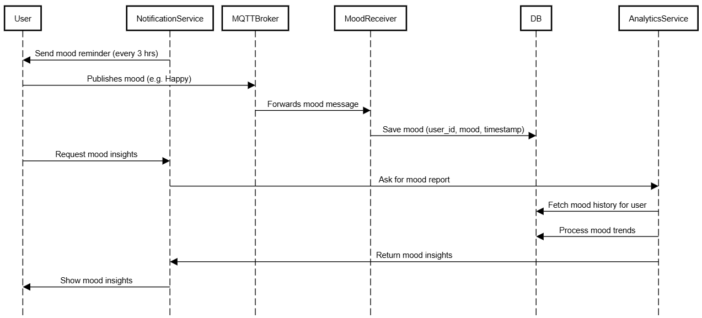

# Real-Time Mood Tracker using Celery, MQTT (EMQX), and Python

## Project Overview

This project is a **Real-Time Mood Tracker** built entirely with **Python**, **Celery**, and **MQTT (EMQX)**. It simulates an automated system where users are asked for their mood at regular intervals. Their responses are collected, processed asynchronously, and stored for later analysis.

---

## Objective

* Track a user’s mood periodically.
* Send notifications asking for the user’s current mood.
* Collect and process mood responses in real-time.
* Use asynchronous processing to ensure non-blocking operations.
* Provide a simple mood history per user.

---

## Key Features

* Automated reminders to collect user moods.
* Real-time mood submission via MQTT.
* Asynchronous task handling using Celery.

---

## Use Case

### "A Day in the Life of a User"

1. A user registers and sets a reminder interval (e.g., every 4 hours).
2. The system sends a mood request every 4 hours using MQTT.
3. The user replies via a simple interface (web, terminal, or app etc).
4. The system stores the mood and updates their mood history.
5. If no reply is received, a retry or follow-up can be scheduled.

---

## System Workflow

1. **User Register**: Enters name and chooses how often they want to be reminded.
2. **Reminder Triggered**: Celery Beat fires every interval.
3. **Mood Prompt Sent**: MQTT publishes a message to user-specific topic.
4. **User Responds**: User replies with a mood (e.g., Happy, Sad).
5. **Response Captured**: MQTT Subscriber receives mood.
6. **Celery Worker**: Asynchronously saves it to the database.
7. **Repeat Loop**: Process repeats as per user interval.

---

## System Architecture

## System Interaction Workflow

		

